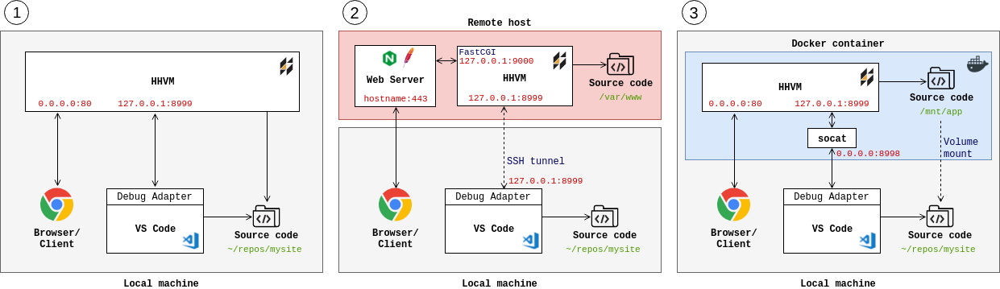

# Using the HHVM Debugger

HHVM versions 3.25 and later come with a built-in debugging extension that can be enabled with a runtime flag. You can use the VS Code debug interface to launch and debug PHP/Hack scripts or attach to an existing HHVM server process on a local or remote machine.

## For local script execution

Add a new HHVM `launch` config to `.vscode/launch.json`. The default template should be good enough, but you can change the values if needed:

`script`: The PHP/Hack script to launch. Use `${file}` to run the currently open file in the editor, or set to any other static file path.  
`hhvmPath`: [Optional] Absolute path to the HHVM executable (default `hhvm`)  
`hhvmArgs`: [Optional] Extra arguments to pass to HHVM when launching the script, if needed  
`cwd`: [Optional] Working directory for the HHVM process

Debug -> Start Debugging (F5) with this configuration selected will launch the currently open PHP/Hack script (or the custom configured file) in a new HHVM process and pipe input/output to the editor OUTPUT tab.

You will need to set breakpoints before script execution to be able to hit them.

## For remote server debugging

Start your HHVM server with the following additional configuration strings in server.ini or CLI args:

`hhvm.debugger.vs_debug_enable=1` to enable the debugging extension  
`hhvm.debugger.vs_debug_listen_port=<port>` to optionally change the port the debugger listens on (default: `8999`)
`hhvm.debugger.vs_debug_domain_socket_path=<socket file path>` to optionally expose the debugger interface over a unix socket rather than a TCP port

E.g. `hhvm -m server -p 8080 -d hhvm.debugger.vs_debug_enable=1 -d hhvm.debugger.vs_debug_listen_port=1234`

You can also use the `--mode vsdebug`, `--vsDebugPort` and `--vsDebugDomainSocketPath` command line arguments for the same purpose.

Add a new HHVM `attach` config to `.vscode/launch.json` and configure as needed:

`host`: [Optional] The remote HHVM host (default: `localhost`)  
`port`: [Optional] The server debugging port, if changed in HHVM config (default: `8999`) 
`socket`: [Optional] Path to a Unix domain socket path. If specified, the debugger will attach to this socket rather than a TCP port.

If the site root on the server is different from your local workspace, set the following to automatically map them: 

`remoteSiteRoot`: [Optional] Absolute path to site root on the HHVM server  
`localWorkspaceRoot`: [Optional] Absolute path to local workspace root. Set to `${workspaceFolder}` to use the current VS Code workspace.

### SSH tunneling

The HHVM debugger port is only exposed on the localhost (loopback) interface, so unless the server is running on the local machine you will likely need to foward a local port to the remote host via a SSH tunnel:

`ssh -nNT -L 8999:localhost:8999 user@remote.machine.com`

You can now connect to localhost:8999 as normal.

### Docker containers

For the same reason, Docker port forwarding won't work for the debugger port. You need to either use your host network driver for the container (`docker run` with `--network host`) or use SSH tunneling or other solutions like [socat](http://www.dest-unreach.org/socat/) instead.

E.g. publish port 8998 to the Docker host and in your container install and run:

`socat tcp-listen:8998,reuseaddr,fork tcp:localhost:8999`

This will foward connections to exposed port 8998 to port 8999 in your container.

### Common server debugging setups

1. Single PHP/Hack script launched by VS Code 
2. Everything running locally on the same network
3. Connected to debugging port on a remote server through a SSH tunnel
4. Running HHVM in a Docker container and forwarding debugger port via [socat](http://www.dest-unreach.org/socat/doc/socat.html)
